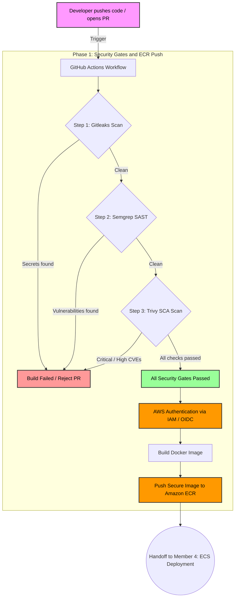

## CI/CD Security Pipeline

```mermaid
graph TD
    classDef dev fill:#f9f,stroke:#333,stroke-width:2px,color:#000;
    classDef security fill:#ff9999,stroke:#333,stroke-width:2px,color:#000;
    classDef success fill:#99ff99,stroke:#333,stroke-width:2px,color:#000;
    classDef aws fill:#ff9900,stroke:#333,stroke-width:2px,color:#000;

    A["Developer pushes code / opens PR"]:::dev -->|"Trigger"| B["GitHub Actions Workflow"]

    subgraph Phase1 ["Phase 1: Security Gates and ECR Push"]
        B --> C{"Step 1: Gitleaks Scan"}
        C -->|"Secrets found"| X["Build Failed / Reject PR"]:::security
        C -->|"Clean"| D{"Step 2: Semgrep SAST"}

        D -->|"Vulnerabilities found"| X
        D -->|"Clean"| E{"Step 3: Trivy SCA Scan"}

        E -->|"Critical / High CVEs"| X
        E -->|"All checks passed"| F["All Security Gates Passed"]:::success

        F --> G["AWS Authentication via IAM / OIDC"]:::aws
        G --> H["Build Docker Image"]
        H --> I["Push Secure Image to Amazon ECR"]:::aws
    end

    I --> J(("Handoff to Member 4: ECS Deployment"))
```